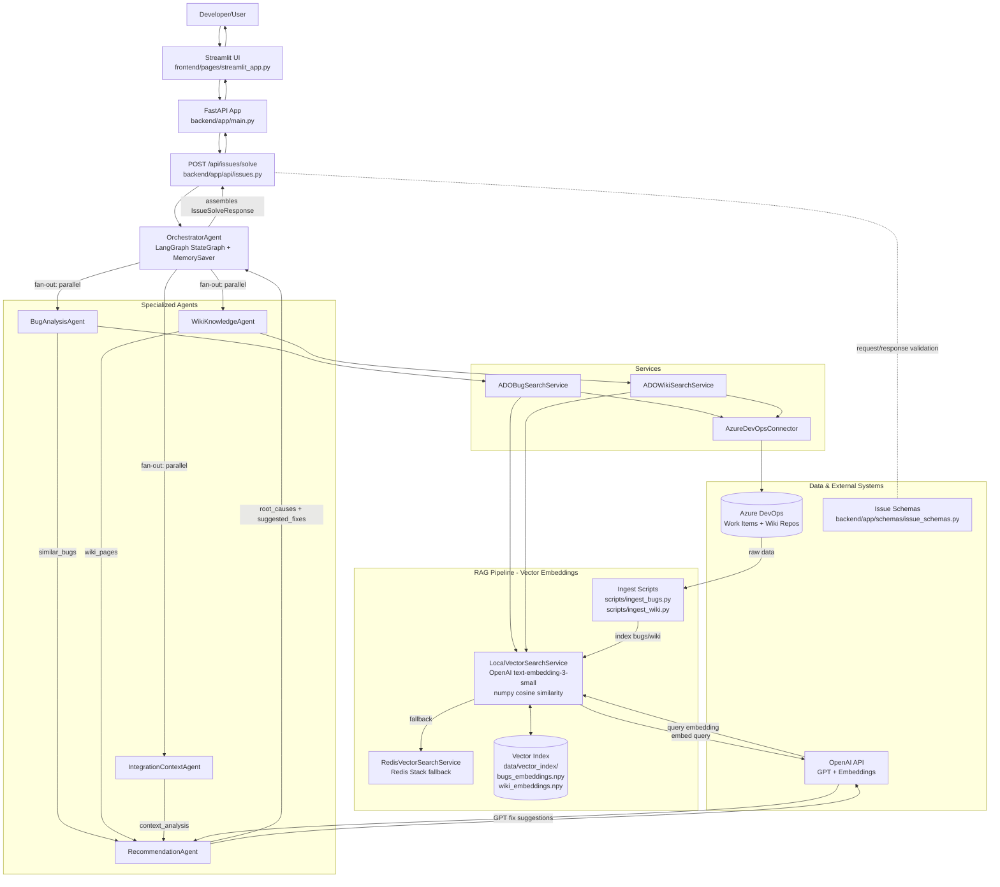

# ErrorLens - AI-Powered Bug Intelligence & Wiki Knowledge Assistant

An intelligent system that connects to Azure DevOps to mine historical bug patterns from work items and lessons learned from wiki pages, accelerating issue resolution through a coordinated multi-agent RAG pipeline.

## Features

- 🧠 **Multi-Agent Architecture**: Coordinated specialized agents for comprehensive analysis
- 🔍 **Bug Analysis Agent**: Searches similar bugs and extracts root causes + fixes
- 📘 **Wiki Knowledge Agent**: Searches best practices and lessons learned
- 🔗 **Integration Context Agent**: Understands modules, APIs, and dependencies
- 🧪 **Recommendation Agent**: Synthesizes insights into actionable recommendations
- 💬 **Multi-user Support**: Session-based conversations with unique user IDs
- 🎯 **DevOps Focus**: Specialized for software development and operations
- 🔄 **Real-time Responses**: FastAPI backend with async processing
- ⏱️ **Auto-refresh**: Vector index automatically re-syncs from Azure DevOps every 48 hours on startup

## Agentic RAG Architecture

ErrorLens is built on **Agentic Retrieval-Augmented Generation (Agentic RAG)** — an evolution beyond plain RAG where multiple specialized agents coordinate retrieval, reasoning, and generation rather than a single retrieve-then-generate step.

### What is Agentic RAG?

| | Plain RAG | Agentic RAG (ErrorLens) |
|---|---|---|
| **Retrieval** | One vector search | Two specialized retrievers (bugs + wiki) with separate indexes |
| **Reasoning** | None | `IntegrationContextAgent` analyzes modules, APIs, dependencies |
| **Generation** | One LLM call | `RecommendationAgent` synthesizes all agent outputs into grounded fixes |
| **Orchestration** | Linear pipeline | LangGraph `StateGraph` with durable checkpointing via `MemorySaver` |
| **Resilience** | Single point of failure | Each agent has independent error handling; AI generation falls back to templates |

### The Three RAG Steps in ErrorLens

```
RETRIEVE  →  BugAnalysisAgent   queries vector index for similar historical bugs
             WikiKnowledgeAgent  queries vector index for relevant wiki pages

AUGMENT   →  RecommendationAgent builds a GPT prompt containing:
               - original user query
               - top retrieved bugs with similarity scores + RCA
               - identified root causes
               - integration context (modules, APIs, dependencies)

GENERATE  →  GPT-4o-mini produces specific, grounded fix suggestions
             based solely on your Azure DevOps history — not generic advice
```

### Why Agentic over Plain RAG?

A single retrieve-and-generate call collapses retrieval, reasoning, and generation into one step with no separation of concerns. ErrorLens instead uses a **parallel fan-out / fan-in agent pipeline**: `BugAnalysisAgent`, `WikiKnowledgeAgent`, and `IntegrationContextAgent` all execute simultaneously on the raw user query (fan-out), then `RecommendationAgent` synthesizes their independent outputs into grounded fix suggestions (fan-in). Bug retrieval, wiki retrieval, dependency analysis, and fix generation are distinct, independently testable, and replaceable stages — swapping out the retrieval strategy or upgrading the generation model requires touching only one agent, not the entire pipeline.

### LangGraph Orchestration

The `OrchestratorAgent` uses a LangGraph `StateGraph` to enforce a reproducible, durable workflow:

```
                              START
                                │
           ┌────────────────────┼────────────────────┐
           │                    │                    │
           ▼                    ▼                    ▼
  run_bug_analysis     run_wiki_knowledge   run_context_analysis
  BugAnalysisAgent     WikiKnowledgeAgent   IntegrationContextAgent
  vector search over   vector search over   keyword-based module/
  historical bugs      wiki pages           API/dep detection
           │                    │                    │
           └────────────────────┼────────────────────┘
                                │  (all three complete before proceeding)
                                ▼
                      run_recommendations
                      RecommendationAgent: GPT-powered synthesis of all above
                                │
                                ▼
                      assemble_response
                      Orchestrator: builds IssueSolveResponse
                                │
                                ▼
                               END
```

`MemorySaver` checkpoints state at every node, so a failure in any agent does not lose prior results — the workflow resumes from the last successful checkpoint.

### Vector Search Pipeline

```
Azure DevOps bugs/wiki
        │
  scripts/ingest_bugs.py
  scripts/ingest_wiki.py
        │
        ▼
  OpenAI text-embedding-3-small
  (1536-dim embeddings)
        │
        ▼
  data/vector_index/
    bugs_embeddings.npy   ←─┐
    bugs_metadata.json       │  LocalVectorSearchService
    wiki_embeddings.npy   ←─┤  (numpy cosine similarity)
    wiki_metadata.json       │
                          ───┘
                          fallback ↓
                     RedisVectorSearchService
                     (Redis Stack + LlamaIndex)
```

Embeddings are persisted on disk so the index survives restarts without requiring Redis Stack. Redis is used as a fallback when available.

**Auto-refresh on startup**: Every time the FastAPI server starts, `main.py` checks the age of the vector index files. If the index is **missing**, **empty**, or **older than 48 hours**, the ingest scripts are automatically re-run to pull fresh bugs and wiki pages from Azure DevOps and rebuild the embeddings — ensuring the knowledge base stays current without manual intervention.

## Tech Stack

- **Backend**: FastAPI, Python
- **Frontend**: Streamlit
- **Cache/Vector Store**: Redis
- **AI**: OpenAI GPT-4o-mini, OpenAI Embeddings
- **Vector Search**: Redis with LlamaIndex
- **Orchestration**: LangGraph (StateGraph + MemorySaver)

## Prerequisites

- Python 3.8+
- Redis instance
- OpenAI API key
- Token to connect to Azure DevOps

## Installation

1. **Clone the repository**:
   ```bash
   git clone <repository-url>
   cd ErrorLens
   ```

2. **Create virtual environment**:
   ```bash
   python -m venv .venv
   # Windows:
   .venv\Scripts\activate
   # macOS/Linux:
   source .venv/bin/activate
   ```

3. **Install dependencies**:
   ```bash
   pip install -r requirements.txt
   ```

4. **Set up environment variables**:
   Create a `.env` file in the root directory:
   ```env
   REDIS_HOST=localhost
   REDIS_PORT=6379
   OPENAI_API_KEY=your_openai_api_key
   AZURE_DEVOPS_ORG=your_organization
   AZURE_DEVOPS_PROJECT=your_project
   AZURE_DEVOPS_TOKEN=your_personal_access_token
   ```

## Running the Application

### Backend (FastAPI)

1. Activate the virtual environment (if not already activated):
   ```bash
   # Windows:
   .venv\Scripts\activate
   # macOS/Linux:
   source .venv/bin/activate
   ```

2. Start the FastAPI server:
   ```bash
   uvicorn backend.app.main:app --host 0.0.0.0 --port 8000 --reload
   ```

The API will be available at: http://localhost:8000

API Documentation: http://localhost:8000/docs

### Frontend (Streamlit)

1. In a new terminal, activate the virtual environment:
   ```bash
   # Windows:
   .venv\Scripts\activate
   # macOS/Linux:
   source .venv/bin/activate
   ```

2. Start the Streamlit app:
   ```bash
   streamlit run frontend/pages/streamlit_app.py 
   ```

The web interface will be available at: http://localhost:8501

## API Endpoints

### Issue Solver Agent
- `POST /api/issues/solve` - Main AI issue solver endpoint
  ```json
  {
    "user_id": "string",
    "message": "string"
  }
  ```

### Bug Search
- `POST /api/bugs/search` - Search historical Azure DevOps bugs
  ```json
  {
    "query": "string"
  }
  ```

### Wiki Search
- `POST /api/wiki/search` - Search Azure DevOps wiki knowledge
  ```json
  {
    "query": "string"
  }
  ```

### Admin — Manual Data Refresh
- `POST /api/admin/refresh` - Manually pull fresh data from Azure DevOps and rebuild the vector index (both local numpy and Redis)
  ```json
  // Response
  {
    "success": true,
    "bugs_ingested": true,
    "wiki_ingested": true,
    "index_age_hours": 0.01,
    "message": "Vector index refreshed successfully from Azure DevOps."
  }
  ```

- `GET /api/admin/index-status` - Check the current age and size of the vector index
  ```json
  // Response
  {
    "bugs_index": { "exists": true, "age_hours": 12.3, "size_kb": 420.5 },
    "wiki_index": { "exists": true, "age_hours": 12.3, "size_kb": 210.0 },
    "oldest_age_hours": 12.3,
    "stale": false,
    "refresh_threshold_hours": 48
  }
  ```

## Project Structure

```
ErrorLens/
├── backend/
│   ├── app/
│   │   ├── main.py                          # FastAPI application entry point
│   │   ├── config.py                        # Application configuration
│   │   ├── api/                             # API route handlers
│   │   │   └── issues.py                    # Issue solver endpoints
│   │   ├── agents/                          # Multi-agent system
│   │   │   ├── base_agent.py                # Abstract base agent class
│   │   │   ├── orchestrator_agent.py        # 🧠 Brain - coordinates all agents
│   │   │   ├── bug_analysis_agent.py        # 🔍 Analyzes bugs from Azure DevOps
│   │   │   ├── wiki_knowledge_agent.py      # 📘 Searches wiki knowledge base
│   │   │   ├── integration_context_agent.py # 🔗 Analyzes modules/APIs/deps
│   │   │   └── recommendation_agent.py      # 🧪 Synthesizes recommendations
│   │   ├── models/                          # Data models
│   │   ├── schemas/                         # Pydantic schemas
│   │   │   └── issue_schemas.py             # Issue-related schemas
│   │   ├── services/                        # Business logic services
│   │   │   ├── azure_devops_connector.py    # Azure DevOps connection
│   │   │   ├── ado_bug_search_service.py    # Bug search from Azure DevOps
│   │   │   └── ado_wiki_search_service.py   # Wiki search from Azure DevOps
│   │   └── utils/                           # Utility functions
├── frontend/
│   ├── app.py                  # Main Streamlit application
│   ├── pages/                  # Additional Streamlit pages
│   ├── components/             # Reusable UI components
│   └── utils/                  # Frontend utilities
├── data/                       # Data files and embeddings
├── scripts/                    # Utility scripts
├── tests/                      # Test suites
├── requirements.txt            # Python dependencies
└── .env                        # Environment variables
```

## System Architecture



## Agent Roles and Workflows

### 🧠 **Multi-Agent Architecture**

The system uses a coordinated multi-agent approach for comprehensive issue resolution:

#### 1. **🧠 Orchestrator Agent (Brain)**
**Role**: Central coordinator of the multi-agent system
**Responsibilities**:
- Understands user query and determines analysis strategy
- Coordinates workflow execution across all agents
- Assembles final recommendations
- Manages agent communication and data flow

**Workflow**:
```
User Query → Query Analysis → Agent Dispatch → Result Assembly → Final Response
```

#### 2. **🔍 Bug Analysis Agent**
**Role**: Searches and analyzes historical bugs from Azure DevOps
**Responsibilities**:
- Queries Azure DevOps for similar bugs
- Extracts root causes from bug patterns
- Identifies applied fixes from resolved issues
- Analyzes common error patterns

**Output**:
- Similar bugs (with relevance scores)
- Common root causes
- Previously applied fixes
- Pattern analysis

#### 3. **📘 Wiki Knowledge Agent**
**Role**: Searches lessons learned and best practices
**Responsibilities**:
- Searches Azure DevOps wiki knowledge base
- Extracts best practices and procedures
- Identifies common patterns and solutions
- References troubleshooting guides

**Output**:
- Relevant wiki pages
- Best practices recommendations
- Step-by-step procedures
- Common patterns documentation

#### 4. **🔗 Integration Context Agent**
**Role**: Understands application architecture and dependencies
**Responsibilities**:
- Identifies affected modules
- Maps API dependencies
- Determines external service dependencies
- Analyzes integration points

**Output**:
- Affected modules
- Involved APIs
- External dependencies
- Service dependencies
- Integration context summary

#### 5. **🧪 Recommendation Agent**
**Role**: Synthesizes insights and generates actionable recommendations
**Responsibilities**:
- Combines insights from all agents
- Synthesizes root cause analysis
- Generates prioritized fix suggestions
- Creates troubleshooting checklist
- Calculates confidence levels

**Output**:
- Ranked root causes with confidence levels
- Prioritized fix suggestions with steps
- Comprehensive troubleshooting checklist
- Overall recommendation confidence (0-100%)

### **Complete Workflow Integration**

```
┌─────────────────────────────────────────────────────────────────┐
│                     Developer Issue Query                       │
└────────────────────────────┬────────────────────────────────────┘
                             │
                    ┌────────▼────────┐
                    │  🧠Orchestrator │
                    │     Agent       │
                    └────────┬────────┘
                             │
          ┌──────────────────┼──────────────────┐
          │                  │                  │
    ┌─────▼────┐      ┌─────▼────┐      ┌─────▼────┐
    │🔍 Bug    │      │📘 Wiki   │      │🔗Context │
    │Analysis  │      │Knowledge │      │Analysis  │
    └─────┬────┘      └─────┬────┘      └─────┬────┘
          │                  │                  │
    ┌─────▼──────────────────▼──────────────────▼────┐
    │      🧪 Recommendation Agent (Synthesis)      │
    │  • Combines all insights                       │
    │  • Generates root causes                       │
    │  • Creates fix recommendations                 │
    │  • Calculates confidence                       │
    └─────┬──────────────────────────────────────────┘
          │
    ┌─────▼────────────────────────────────────┐
    │      Final Response to Developer         │
    │  • Root cause analysis                   │
    │  • Suggested fixes with steps            │
    │  • Troubleshooting checklist             │
    │  • Recommendation confidence (%)         │
    └──────────────────────────────────────────┘
```

### **Data Flow Between Agents**

```
                        ┌──────────────────────────┐
                        │        user_query         │
                        └────────────┬─────────────┘
                                     │  fan-out (simultaneous)
              ┌──────────────────────┼──────────────────────┐
              │                      │                      │
              ▼                      ▼                      ▼
   BugAnalysisAgent       WikiKnowledgeAgent    IntegrationContextAgent
   → similar_bugs         → wiki_pages          → context_analysis
              │                      │                      │
              └──────────────────────┼──────────────────────┘
                                     │  fan-in (all outputs merged)
                                     ▼
                           RecommendationAgent
                           → root_causes + suggested_fixes
                                     │
                                     ▼
                              Orchestrator
                           → IssueSolveResponse
```

## Detailed Setup Instructions

### 1. Environment Setup

**Windows:**
```bash
python -m venv .venv
.venv\Scripts\activate
```

**macOS/Linux:**
```bash
python -m venv .venv
source .venv/bin/activate
```

### 2. Azure DevOps Configuration

1. Create a Personal Access Token (PAT) in Azure DevOps
2. Grant permissions for Work Items (read), Wiki (read)
3. Add to `.env` file:
   ```
   AZURE_DEVOPS_ORG=your_organization_name
   AZURE_DEVOPS_PROJECT=your_project_name
   AZURE_DEVOPS_TOKEN=your_pat_token
   ```

### 3. Redis Setup

1. Install Redis server locally or use cloud Redis
2. Ensure Redis is running on default port 6379
3. Initialize vector store using setup scripts in `scripts/`

### 4. OpenAI Configuration

1. Get API key from OpenAI platform
2. Add to `.env` file:
   ```
   OPENAI_API_KEY=your_actual_api_key_here
   ```

### 5. Data Ingestion Setup

Run the data ingestion scripts:
```bash
python scripts/ingest_bugs.py
python scripts/ingest_wiki.py
```

This will:
- Fetch bugs and wiki from Azure DevOps
- Generate embeddings
- Store in Redis vector database

## Configuration

### Environment Variables

Required environment variables in `.env`:
```env
REDIS_HOST=localhost
REDIS_PORT=6379
OPENAI_API_KEY=your_openai_api_key
AZURE_DEVOPS_ORG=your_organization
AZURE_DEVOPS_PROJECT=your_project
AZURE_DEVOPS_TOKEN=your_personal_access_token
```

### CORS Configuration

The FastAPI backend is configured with CORS to allow requests from the Streamlit frontend. Modify `backend/app/main.py` if you need different CORS settings.

## Development

### Running Tests

```bash
pytest
```

### Code Quality

```bash
# Linting and formatting (add your preferred tools)
```

## Usage Examples

### Basic Issue Resolution
1. Start both backend and frontend
2. In the web interface, enter: "My build is failing with error XYZ"
3. The AI will search similar bugs and provide solutions

### Bug Search
The system automatically searches relevant historical bugs based on queries.

### Wiki Queries
Ask questions like: "How do I configure CI/CD pipeline?"

## Contributing

1. Fork the repository
2. Create a feature branch (`git checkout -b feature/amazing-feature`)
3. Commit your changes (`git commit -m 'Add amazing feature'`)
4. Push to the branch (`git push origin feature/amazing-feature`)
5. Open a Pull Request

## License

This project is licensed under the MIT License - see the LICENSE file for details.

## Acknowledgments

- Built with FastAPI, Streamlit, and OpenAI
- Vector search powered by Redis and LlamaIndex
- Azure DevOps integration for knowledge base